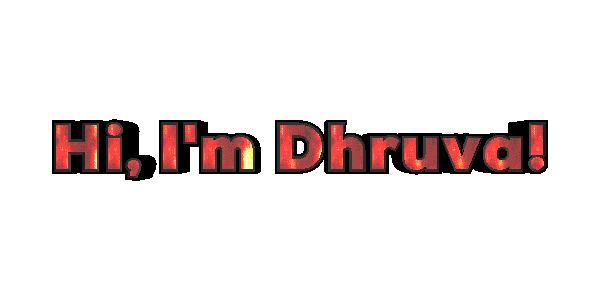
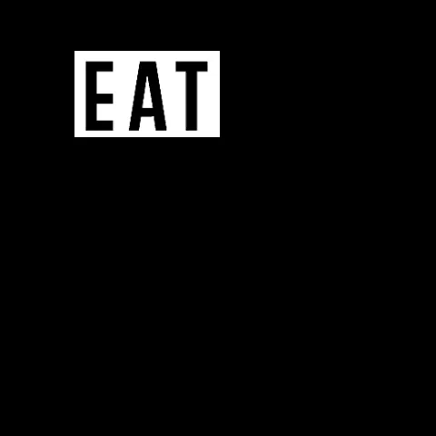

# Welcome 

 

 

<!--
- ⌨️ Programming Languages I've used:

            
  

<-->

 

- 🙌 I'm  open to: **Machine Learning, Data Analyst, Software Developer roles**

  

 

- 🔭 I’m currently working on: **Chatbot Song Recommender System(CakeChat)**

- 🌱 I’m currently learning: **RestAPI | HRED | Docker**

- 👯 I’m looking to collaborate on: **Developing new and intriguing open-source projects, with the community, for the community**

- 💬 Ask me about: **Technology | Anime | Movies | Music | Football | History**

- 🤓 Active User at: **GitHub | Discord | LinkedIn**

- 📫 How to reach me:

    * [**Drop a Mail**](mailto:etoorvadhni@gmail.com)

    * [**Connect via LinkedIn**](https://www.linkedin.com/in/dhruvaetoor/)

    

- 😄 Pronouns: **He/Him**

- ⚡ Fun Facts: 

    * *Besides programming, I'm a **Melophile** for life and love to cook when I'm free.*

    * *You know you're a programmer when you spend a day to find the problem, and then fix it with one line of code.*
    
    * *If you're still reading, Let's Connect !!*
